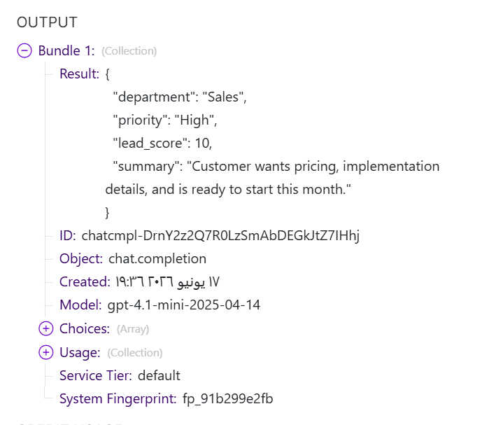
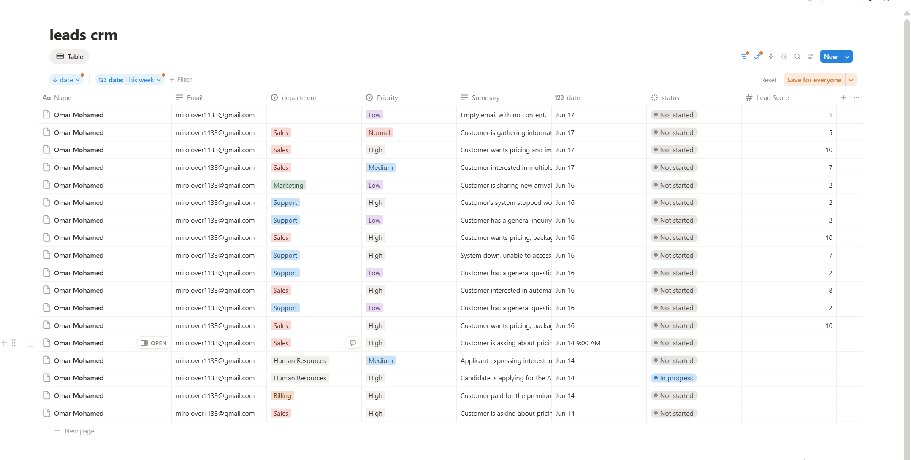
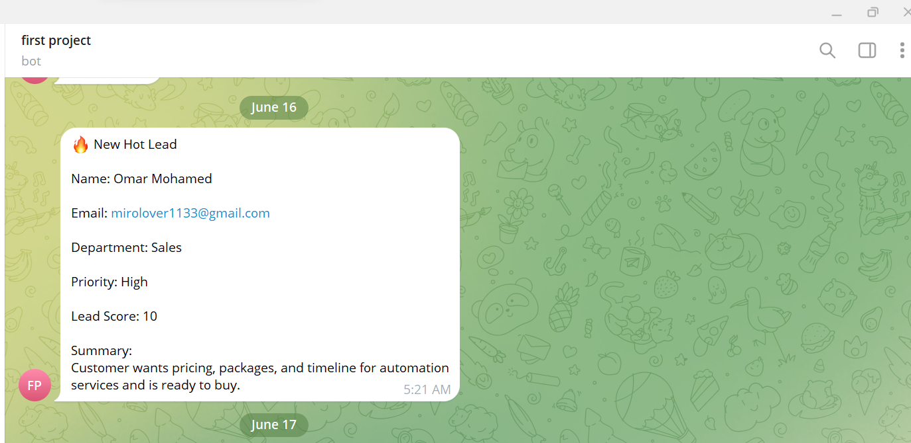
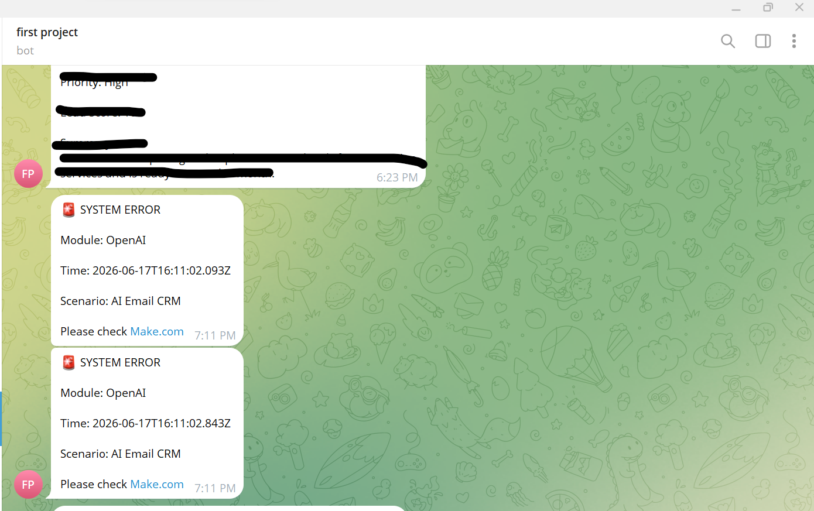

 # Smart AI Email Lead Qualification System

### 🚀 The Problem
Businesses are overwhelmed by incoming emails, wasting time on spam and manual data entry. Valuable leads often slip through the cracks.

### 💡 The Solution
A fully automated system built on **Make.com** that:
- **Filters Spam:** Automatically removes junk mail and newsletters.
- **Analyzes Intent:** Uses **OpenAI** to categorize leads and score their urgency.
- **Centralizes Data:** Syncs qualified leads directly to **Notion CRM**.
- **Alerts Instantly:** Sends "Hot Leads" via **Telegram**.
- **Self-Heals:** Includes an **Error Handling** route to improves reliability.
## ⚡ Key Features

- AI-powered email classification
- Lead scoring system
- Department detection
- Priority assignment
- Spam filtering
- Telegram notifications
- Notion CRM integration
- Error handling route
### 🛠️ Tech Stack
- **Automation:** Make.com
- **Intelligence:** OpenAI (GPT)
- **Database:** Notion
- **Communication:** Gmail & Telegram

### 📸 System Architecture
### 📊 Project Workflow Overview

### 🤖 OpenAI Output Configuration

### 📋 Notion CRM Integration

### 🔔 Telegram Hot Lead Alert

### 🛡️ Error Handling Route

## 📈 Results

- Reduced manual email sorting by 90%
- Automatically classified incoming emails
- Prioritized high-value leads
- Centralized lead management inside Notion CRM
- Instant Telegram alerts for hot opportunities
- ## 🚀 Future Improvements

- Multi-language email analysis
- Sentiment analysis
- Automatic email replies
- Dashboard reporting
- CRM integrations (HubSpot, Salesforce)
